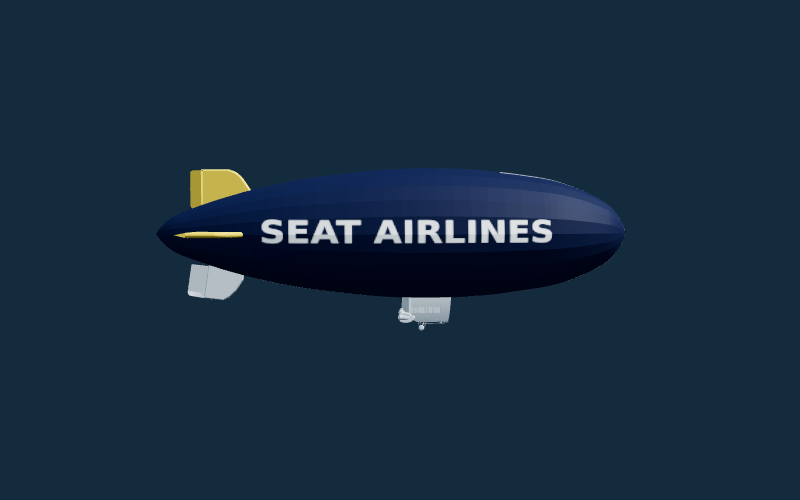
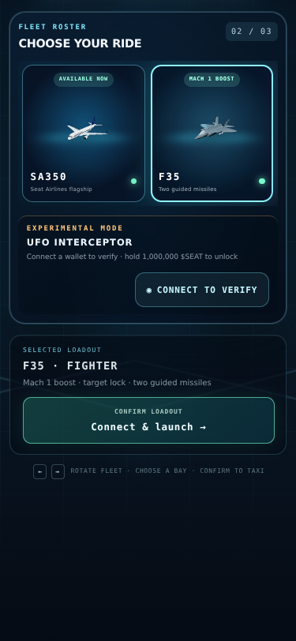

# Minigame fleet

The selector offers the SA350, F35 and UFO. The F35 uses the same launch flow as
the airliner. The UFO retains its existing 1,000,000 $SEAT holding requirement.

| Control | F35 action |
| --- | --- |
| WASD, arrows, left stick, or touch drag | Pitch and bank |
| Space or the Mach 1 button | Boost |
| R, gamepad right trigger, or FIRE | Fire one missile at the locked target |

## Blimp

One SEAT AIRLINES blimp appears about 1 km ahead per flight. It cruises at
450 m (about 1,475 ft) above the ground at its spawn position and drifts at
12 m/s. Its hull is 68 m long.

A collision destroys it, awards **5,000 points once**, and damages the
aircraft's port elevator. The flap disappears, pitch response weakens, and
banking and level flight become harder. Damage lasts until replay. A missile
hit also pays 5,000, without collision damage to the player.

## F35 and targeting

Cruise airspeed is 1.65 times the SA350's airspeed at the same height. Boost
lasts 4.5 seconds and eases toward the local speed of sound. The Mach display,
afterburner, shock cloud and sonic sound indicate the full burn.

Each flight carries **two missiles**, one beneath each wing. Aim within
12.6 degrees of a target, inside 2.6 km, for 0.75 seconds to acquire a lock.
FIRE is enabled only with a completed lock, remaining ammunition and an expired
0.45-second firing cooldown. One press releases one missile; holding R or the
right trigger does not release the other. Missiles home on the target, expire
after eight seconds, and use swept collision checks.

The blimp and UFO scout are targets. The scout's path is anchored in the world
when it appears, so steering the jet can bring it into the sights. Destroying
the scout pays 1,000 points. Replay restores both missiles and clears the lock,
projectiles, explosions and tail damage.

## UFO attack frequency

Airliners first attack a player UFO after 12–18 seconds. Only one unsettled
attacker may be active. The next attack waits another 18–28 seconds after the
previous encounter settles. This rest period never shrinks during a flight;
incoming speed may still increase.

## Tuning and verification

`src/lib/aerialCombat.ts` owns target selection, missiles, blimp collisions and
the `JET`/`BLIMP` constants. `landingGame.ts` owns vehicle handling and
`rammer.ts` owns the UFO encounter cadence. `scoring.ts` is shared with the
Worker, so the leaderboard accepts the new bonuses.

`test/aerialCombat.test.mjs` covers Mach 1, target acquisition, steering toward
the UFO, individual firing, ammunition, swept collisions, the wider flagship
footprint, tail authority, replay and score limits. `test/rammer.test.mjs`
checks cooldowns and prevents overlapping attackers.

Browser checks use the existing virtual capture clock with software WebGL.
They cover the selector, keyboard missile launch, pointer missile launch at a
UFO, Mach 1, both blimp wordmarks, and controls at 320×568, 375×812 and 844×390.
